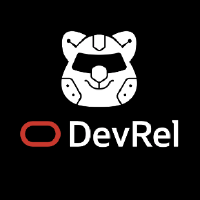

# Oracle Developer Relations

## Featured Projects
We've got a lot of exciting stuff that we're busy working on.  Here are a few highlights, though this is just a glimpse (check out [our repos](https://github.com/oracle-devrel/repositories) for more info):
* [Cloud Car](https://github.com/oracle-devrel/cloud-car)
    
    Build an Oracle Cloud Infrastructure-controlled Raspberry Pi and Arduino powered open-wheel race car made with plastic bricks!
    
* [RedBull Honda Racing and Oracle Analytics Hands-on-Lab](https://github.com/oracle-devrel/redbull-analytics-hol)
    
    Learn machine learning the fun way, with Oracle and RedBull Racing
    
* [Using Open Policy Agent with OCI](https://github.com/oracle-devrel/oci-pac-opa)

    A sample policy-as-code solution for OCI, using Open Policy Agent

## Getting Started
Can't wait to get started?!  Check out our [publishing section](publishing/index.md) which will step you through how to get a repository, how to work with DevRel repositories and more.

## About Us
Curious who we are?  Why are we doing what we're doing?  Why is the sky blue?  Well, we won't be answering the last question, but learn more about our team [here](about_us.md).